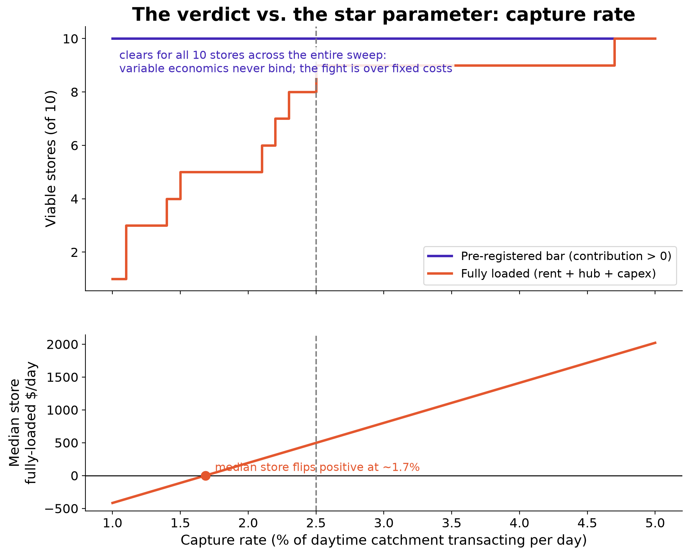
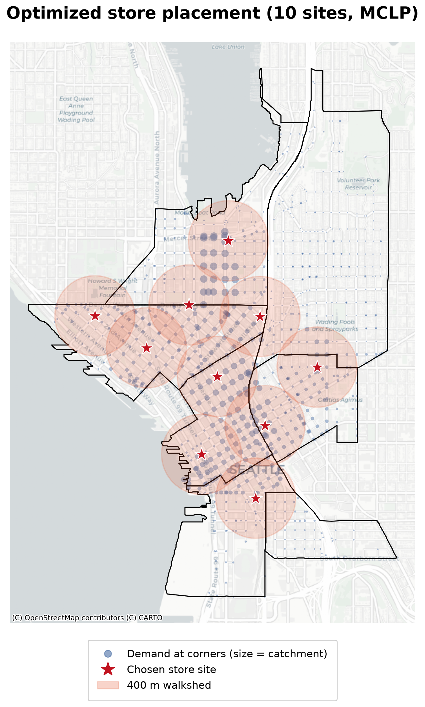
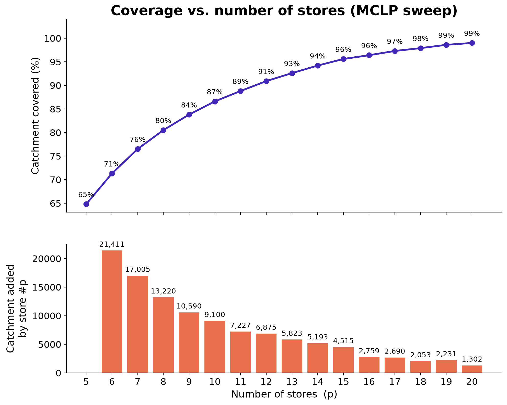
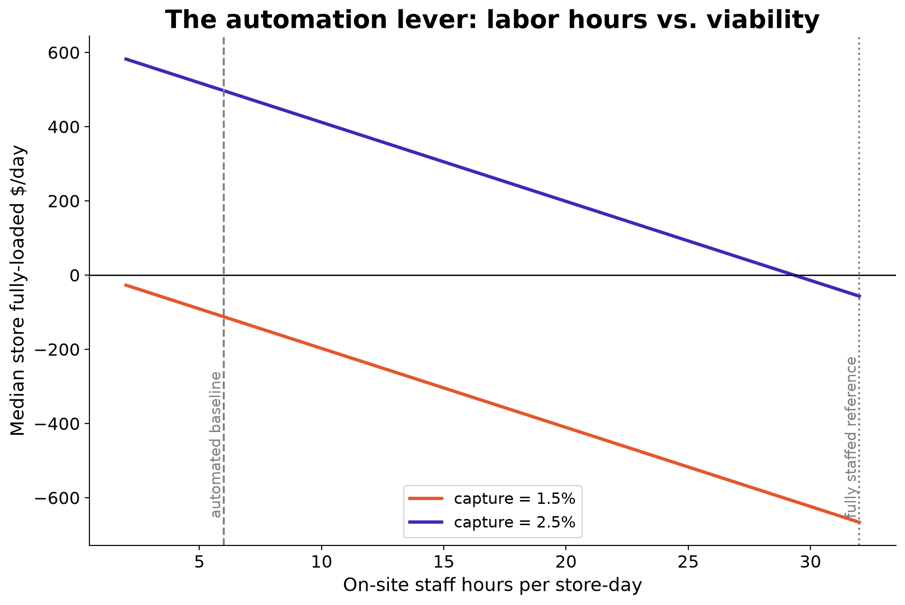

# Can Seattle Support a Japan-Style Fresh-Convenience Network?

**A logistics + operations feasibility model** — demand → store siting → delivery routing →
unit economics — for a konbini-inspired network of **low-labor automated fresh-convenience
micro-stores** in Seattle's dense core. Built on real census, jobs, and street-network data,
with every assumption flagged and the load-bearing ones swept.

> **Verdict: conditionally feasible.** The condition is demand — the median store turns
> fully-loaded positive above a **~1.7% daily capture rate** of its walkshed population.
> Automation is the margin-maker at Seattle wages: cutting on-site labor from a staffed
> model (32 h/day) to an automated one (6 h/day) is worth **~$554 per store-day**, moving
> the required capture from ~2.6% down to ~1.7%. Below ~1.5% capture the median store
> loses money at any staffing level — automation widens the viable band but cannot rescue
> soft demand; only the densest few corners stay positive.



## 🎛️ Explore it interactively

The model doubles as a what-if tool: pick the store count, walkshed radius, capture
rate, wages, and staffing; the optimizer re-places the stores on the Seattle map and
the per-store P&L updates live (stores turn green/red as they clear or miss viability).

```bash
streamlit run app/app.py
```

No API keys needed — the demand surface ships precomputed ([app/](app/)). Placement
re-optimizes in a few seconds when store count or radius changes; the economic levers
respond instantly.

---

## Why I built this

Right after graduating I moved out of my apartment and, three days later, was on a plane to
Japan — seventeen days across Tokyo, Kyoto, Hiroshima, and Okinawa. The thing I couldn't stop
thinking about on the flight home wasn't a temple or a view. It was the **convenience stores
and vending machines**: how something that casual could deliver quality I'd have expected from
a sit-down restaurant. Seattle is a dense city like the ones I'd just walked through — so I
wanted to actually *know*: could that model work here? This project is me answering that the
honest way, by building a model instead of guessing.

## The question

Japanese konbini run a fresh-food system American convenience stores don't attempt: dense
store clusters, nearby commissaries, and 2–3 temperature-controlled deliveries per day on
short-shelf-life items. The question is live — 7-Eleven has announced ~1,300 konbini-style
North American stores by 2030, with exactly this logistics flagged as the obstacle.

The catch is economics. Japan's model leans on affordable, dense labor; Seattle's minimum
wage ($21.30, 2026) is among the highest in the U.S., and the closest American attempts have
struggled — **Amazon Go is being wound down and Foxtrot went bankrupt in 2024**, failures
that industry coverage attributes largely to cost structure and pricing rather than to a
proven absence of demand. So the node modeled here is a **low-labor, largely automated fresh micro-store**,
and *how automated it has to be* is the lever the study turns on. (Amazon Go is the
cautionary reference: it automated *checkout* only, kept restocking/prep labor, and paid for
expensive sensor tech — one failed design point, not proof the concept can't work.)

## The konbini system being modeled

| Structural feature | Maps to |
|---|---|
| Area dominance (tight clustering) | Facility location / density |
| Combined distribution centers | Fixed SoDo commissary hub |
| Multiple daily fresh deliveries (2–3×/day) | Routing + cadence cost |
| JIT small-batch POS-driven ordering | Demand layer (future: sensing) |

## Related work

The methods are deliberately established: set-covering / maximal-covering facility location
and multi-depot capacitated VRP with time windows are mature techniques, and the closest
template is a U.S. food-desert study combining set-covering with MDCVRP-TW across three
counties ([Haider et al., 2022, *Socio-Economic Planning Sciences*](https://www.chkwon.net/papers/haider_creating.pdf)). This project adapts that location-routing structure to a different application —
konbini multi-daily fresh cadence, area-dominance density, and Seattle's specific
labor/geography economics. Siting uses **MCLP** (maximal covering with fixed p, per Church &
ReVelle) rather than set-covering, because capital — not coverage — is the binding
constraint in a commercial rollout. The location-routing chicken-and-egg is resolved by the
**fixed-hub decomposition**: the SoDo commissary is a settled input, not a decision
variable.

## Approach and results, phase by phase

**1 — Demand.** Weighted daytime catchment per neighborhood (`workers + 0.5×residents`),
built from ACS 2024 residents + LODES 2023 workplace jobs, area-apportioned from census
tracts to 7 neighborhoods. Worker-weighting is decisive: Capitol Hill is #1 by residents
but #5 by demand; the CBD (7k residents, 77k jobs) dominates.

**2 — Network.** OSMnx drive graph (2,251 intersections), per-edge speeds from OSM tags,
×1.4 congestion factor. All 7 neighborhood centers sit 3.9–9.8 congested minutes from the
SoDo hub — ~3× headroom inside the 30-min fresh window. **Reach is not the constraint** in this
land-contiguous core.

**3 — Siting.** MCLP over 1,061 street-corner demand points (demand split from tract
pieces; corners are both demand and candidate sites). Demand concentration is extreme —
5 stores cover 65%, 10 cover 87%, 20 cover 99% — and marginal coverage collapses 16× from
store #6 to store #20. The optimizer reproduces konbini area-dominance clustering
unprompted.




**4 — Routing.** OR-Tools VRP under van capacity + the fresh window. The **window binds,
not capacity**: ~3 stops per van run → 4 vans for 10 stores → **$773/day ($77/store)**,
fleet-dominated. (Freshness clock stops at the last handoff; the paid return leg doesn't
age goods — that one semantic choice is worth a van.)

**5 — Economics.** Per-store P&L against the **pre-registered bar** (contribution margin
> 0, committed in `assumptions.yaml` before any results): 10/10 stores clear it at baseline
(break-even: 88 txns/day). Fully loaded (rent + hub share + amortized capex): 9/10 positive.
Then the star sweeps produce the verdict and the automation result:



## What flips it

| Lever | Tipping point |
|---|---|
| **Capture rate** (the star) | median store viable above **~1.7%** (automated) / ~2.6% (staffed); below ~1.5% the median fails at any staffing level |
| **Automation** (6h vs 32h labor @ $21.30) | ≈ **$554/store-day** ≈ 0.9pp of capture slack |
| **Store count p** | marginal store revenue falls 16× across p=6→20; formally evaluated at p=10 (9 of 10 viable) — marginal-store arithmetic puts the ceiling in the mid-teens |
| Fresh window | binds the fleet (not capacity) — relaxing it shrinks vans; tightening it multiplies them |
| **Joint pessimism** (capture 1.5% + rent $12k + spoilage 15% + wage $26) | network flips to **−$3.5k/day**; only the 3 densest corners survive — the verdict is genuinely conditional |

## Honest limitations

Assumption-driven by design; the thresholds, not the point estimates, are the finding.
Baseline is optimistic (top-store volumes at busy-konbini levels; flat $8k/mo rent on
deliberately-optimal corners). Capture rate is **derived** (cited store volumes ÷ our
computed walkshed populations), not measured — which is why it is the star sensitivity.
Full list + the complete assumption table: [reports/findings.md](reports/findings.md).
Every external data source and benchmark, with links: [SOURCES.md](SOURCES.md).

## Reproducing this

```bash
git clone <this repo> && cd SEATTLE_FRESH_NETWORK
python -m venv .venv
.venv\Scripts\activate            # Windows
pip install -r requirements.txt   # exact versions: requirements.lock.txt
copy .env.example .env            # then paste your free Census API key into .env
python run_all.py                 # full chain; first run pulls + caches external data
```

Every tunable lives in [`assumptions.yaml`](assumptions.yaml) with a
`cited | derived | assumed` flag — change a number, re-run, watch the verdict move.
Figures land in `outputs/figures/`, tables in `outputs/tables/`.

## Future work

Cross-water expansion (Ballard / Eastside — where Seattle's water-fragmented geography
actually bites), per-store rent surfaces, block-level demand, gravity-model catchments,
joint location-routing, stochastic demand simulation, and consumer demand sensing as a
richer input layer. Documented in [findings](reports/findings.md); deliberately not built —
a finished small thing beats a half-built big one.

**Re-parameterization to other node formats.** The chain is format-agnostic: any
"many small nodes, replenished from a hub, serving walk-up demand" concept is a
parameter swap in `assumptions.yaml`. The natural next case is a **single-product
automated kiosk** (e.g., premium drink machines): tiny capex, near-zero labor
(restocking merges into the delivery stop), a shorter impulse-purchase walkshed, and
1–2×/day replenishment — where the model predicts the binding constraint flips from
the freshness window to **machine capacity**, the mirror image of the store result.

---

*Build spec: [`SEATTLE_PLAN.md`](SEATTLE_PLAN.md) · Data sources: [`SOURCES.md`](SOURCES.md) ·
Full narrative: [`reports/findings.md`](reports/findings.md)*
