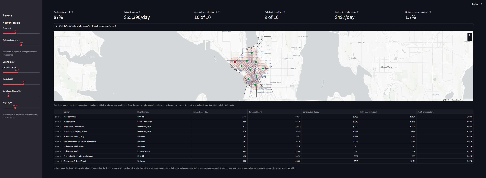
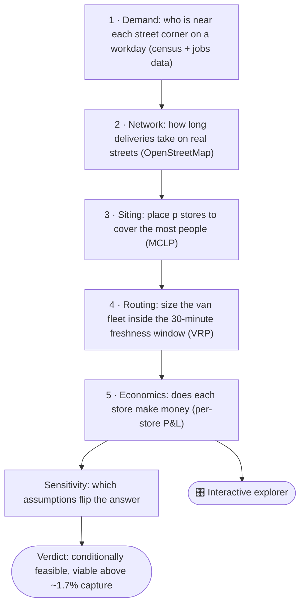

# Can Seattle Support a Japan-Style Fresh-Convenience Network?

**TL;DR:** Japanese konbini sell genuinely good fresh food on practically every corner,
and I wanted to know if that could work in Seattle. So I built a model that tests the
whole chain for a network of small, mostly automated fresh-food stores: where they
should go, whether vans can keep them stocked from one central kitchen, and whether each
store actually makes money, all built on real census, jobs, and street data. The short
answer: it can work, but demand is what decides everything. A store needs roughly 1 in 60 of the
people within a five-minute walk to buy something each day. Automation helps the margins
a lot, but it can't save a store that people don't visit.

**▶ [Live demo](https://mij4pkvfcvprwshdzighpg.streamlit.app):** explore the model in
your browser, no install needed.

> **Verdict: conditionally feasible.** In this model, demand comes down to one number, the **capture rate**: out of everyone within a short
> walk of a store (its walkshed, roughly a 5-minute or 400 meter radius), the share who
> actually buy something on a given day. The median store turns fully-loaded positive
> (profitable with every cost counted, rent and equipment included) above a **~1.7%
> daily capture rate**.
> Automation level is also a margin-maker, especially with Seattle wages: cutting on-site labor from a staffed
> model (32 h/day) to an automated one (6 h/day) is worth **~$554 per store-day**, moving
> the required capture from ~2.6% down to ~1.7%. Below ~1.5% capture the median store
> loses money at any staffing level, and only the densest few corners stay open.


## 🎛️ Explore it interactively

The model also doubles as a what-if dashboard: pick the store count, walkshed radius, capture
rate, wages, and staffing; the optimizer re-places the stores on the Seattle map and the
per-store P&L updates live. Each store is a real corner ("15th Avenue & East Madison
Street, Capitol Hill"), turns green/red as it clears or misses fully-loaded viability,
and reports the **capture rate it would need to break even**. Drag the staffing slider
and the study's headline thresholds (~1.7% automated vs ~2.6% staffed) will reproduce on
screen.



```bash
python -m streamlit run app/app.py
```

No API keys are needed. The demand surface ships precomputed ([app/](app/)). Placement
re-optimizes in a few seconds when store count or radius changes; the economic levers
respond instantly.

---

## Why I built this

Right after graduating in May of 2026 I moved out of my university apartment and a few days later, I was on a plane to
Japan. I spent eighteen days across Tokyo, Kyoto, Hiroshima, Osaka, and Okinawa. Somehow, after this amazing trip, the thing I couldn't stop
thinking about on the flight home wasn't a temple or a view, but it was the **convenience stores
and vending machines**. I loved how something that casual could deliver quality I'd have expected from
a sit-down restaurant. Seattle is a dense city like the ones I'd just walked through, so I
wanted to actually *know*: could that model work here? 

## The question

Japanese konbini run a fresh-food system American convenience stores have not yet fully attempted: dense
store clusters, nearby commissaries, and 2–3 temperature-controlled deliveries per day on
short-shelf-life items. 7-Eleven has announced ~1,300 konbini-style
North American stores by 2030, with exactly this logistics flagged as the obstacle.

The main catch is economics. Japan's model leans on affordable, dense labor. But Seattle's minimum
wage is among the highest in the U.S. ($21.30 in 2026), and the closest American attempts have not been
very successful: **Amazon Go is being wound down and Foxtrot went bankrupt in 2024**. These failures
are largely attributed to cost structure and pricing rather than to a
proven absence of demand. So the node modeled here is a **low-labor, largely automated fresh micro-store**,
and *how automated it has to be* is the lever the study turns on. (Amazon Go is a
cautionary reference I used: it automated *checkout* only, kept restocking/prep labor, and paid for
expensive sensor tech, one failed design point, not proof the concept can't work.)

## The konbini system being modeled

| Structural feature | Maps to |
|---|---|
| Area dominance (tight clustering) | Facility location / density |
| Combined distribution centers | Fixed SoDo commissary hub |
| Multiple daily fresh deliveries (2–3×/day) | Routing + cadence cost |
| JIT small-batch POS-driven ordering | Demand layer (future: sensing) |

## Related work

The methods I used are deliberately established: set-covering / maximal-covering facility location
and multi-depot capacitated VRP with time windows are mature techniques, and the closest
template is a U.S. food-desert study combining set-covering with MDCVRP-TW across three
counties ([Haider et al., 2022, *Socio-Economic Planning Sciences*](https://www.chkwon.net/papers/haider_creating.pdf)). This project adapts that location-routing structure to a different application,
konbini multi-daily fresh cadence, area-dominance density, and Seattle's specific
labor/geography economics. Siting uses **MCLP** (maximal covering with fixed p, per Church &
ReVelle) rather than set-covering, because capital, not coverage, is the binding
constraint in a real-world commercial rollout. Store placement and delivery routing each depend on the other. I cut the loop by fixing the hub location: SoDo is an input chosen on zoning and freeway access, not a decision variable, so siting and routing can be solved in sequence.

## Approach and results, phase by phase



**1 — Demand.** Weighted daytime catchment per neighborhood (`workers + 0.5×residents`),
built from ACS 2024 residents + LODES 2023 workplace jobs, area-apportioned from census
tracts to 7 neighborhoods. Worker-weighting is decisive: Capitol Hill is #1 by residents
but #5 by demand; Downtown/CBD (7k residents, 77k jobs) dominates.

**2 — Network.** I built a drivable street map of the study area from OpenStreetMap
(2,251 intersections), estimated realistic speeds from road types, and slowed everything
by 40% to reflect downtown traffic. Even so, every neighborhood is only 4 to 10 driving
minutes from the SoDo commissary, against a 30-minute freshness deadline. **Distance is
not what makes or breaks this business**: in this land-connected core, a delivery vehicle usually reaches
everywhere with about 3× time to spare.

**3 — Siting.** A coverage optimizer (MCLP) picks, out of 1,061 street corners carrying
the demand, the corners that put the most people within a 5-minute walk of a store.
Demand is so concentrated that 5 stores cover 65% of it, 10 cover 87%, and 20 cover 99%.
Each added store buys less than the last: store #6 adds 16× more coverage than store
#20. Without being told to, the optimizer ended up reproducing the konbini playbook of clustered,
overlapping walksheds along the Belltown, Downtown, Pioneer Square spine.


**4 — Routing.** A vehicle-routing solver plans refrigerated van runs from the hub under
two limits: van capacity and the freshness deadline. **The deadline binds, never
capacity**: vans leave far from full but can only reach about 3 stores before fresh
goods time out, so 10 stores need 4 vans at **$773/day ($77 per store)**. One modeling
choice was worth an entire van: the freshness clock stops at the last store restocked,
because the paid drive back to the hub doesn't age any food.

**5 — Economics.** Each store faces a daily profit test at two levels. *Contribution*,
my pre-registered feasibility bar (committed in `assumptions.yaml` before any results),
asks whether a day of operating pays for its own product, delivery, and labor: all 10
stores clear it, needing just 88 transactions a day. *Fully loaded* adds the fixed
bills, rent plus a share of the commissary plus equipment paid off over 7 years: 9 of 10
stay positive. The sensitivity sweeps then produce the verdict:


## What flips it

The exact profit numbers matter less than the tipping points, so every big lever is
swept until the verdict changes:

| Lever | Tipping point |
|---|---|
| **Capture rate** (the star) | Median store viable above **~1.7%** automated, ~2.6% staffed. Below ~1.5%, the median store fails at any staffing level |
| **Automation** (6h vs 32h labor at $21.30) | Worth ≈ **$554 per store-day**, the same relief as ~0.9 percentage points of extra capture |
| **Store count p** | Each added store covers far less: #20 buys 16× less than #6. Evaluated at p=10 (9 of 10 viable); rough ceiling in the mid-teens |
| **Fresh window** | Sets the fleet size: loosening it removes vans, tightening it multiplies them |
| **Joint pessimism** (capture 1.5% + rent $12k + spoilage 15% + wage $26) | Network flips to **−$3.5k/day** and only the 3 densest corners survive. The verdict is genuinely conditional |

## Honest limitations

This model's job is to find tipping points, not to predict exact profits: every input is
an explicit assumption, and the thresholds are the main finding. The baseline leans
optimistic. The busiest stores are projected at volumes only the busiest konbini reach,
and rent is a flat $8k/month even though the optimizer deliberately picks the best
corners downtown. The most important input, the capture rate, is **derived** (published
store volumes divided by my computed walkshed populations), not measured, which is
why it is the headline sensitivity. Theft and external shrink are not modeled:
spoilage covers waste from unsold goods, not loss, and shrink is a real risk for a
lightly staffed urban store. Demand is also steady-state from day one, with no ramp-up
period or marketing cost, so early cash needs are understated.
Full list + the complete assumption table: [reports/findings.md](reports/findings.md).
Every external data source and benchmark, with links: [SOURCES.md](SOURCES.md).

## Reproducing this

```bash
git clone <this repo> && cd SEATTLE_FRESH_NETWORK
python -m venv .venv
.venv\Scripts\activate            # Windows
pip install -r requirements.txt   # exact versions: requirements.lock.txt
copy .env.example .env            # then paste your free Census API key into .env
python run_all.py                 # full chain, ~3 minutes; first run pulls + caches external data
```

Every tunable lives in [`assumptions.yaml`](assumptions.yaml) with a
`cited | derived | assumed` flag — change a number, re-run, watch the verdict move.
Figures land in `outputs/figures/`, tables in `outputs/tables/`.

## Future work
Cross-water expansion to Ballard and the Eastside, where Seattle's water-cut geography
would actually stress the delivery window; per-store rent estimates instead of one flat
rent; finer block-level demand; distance-decayed catchments (someone next to a store
should count for more than someone at the walkshed edge); optimizing siting and routing
jointly; and simulating day-to-day demand swings instead of steady averages. Details in
[findings](reports/findings.md).

**Re-parameterization to other node formats.** The pipeline doesn't care that the node
is a konbini-style store: anything shaped like "many small nodes, restocked from a hub,
serving walk-up demand" is a parameter swap in `assumptions.yaml`. The natural next case
is a **single-product automated kiosk**: tiny capex,
near-zero labor since restocking folds into the delivery stop, a shorter
impulse-purchase walkshed, and 1–2 deliveries a day. The model predicts the binding
constraint there flips from the freshness window to **machine capacity**, the mirror
image of the store result.

---

*Build spec: [`SEATTLE_PLAN.md`](SEATTLE_PLAN.md) · Data sources: [`SOURCES.md`](SOURCES.md) ·
Full narrative: [`reports/findings.md`](reports/findings.md)*
